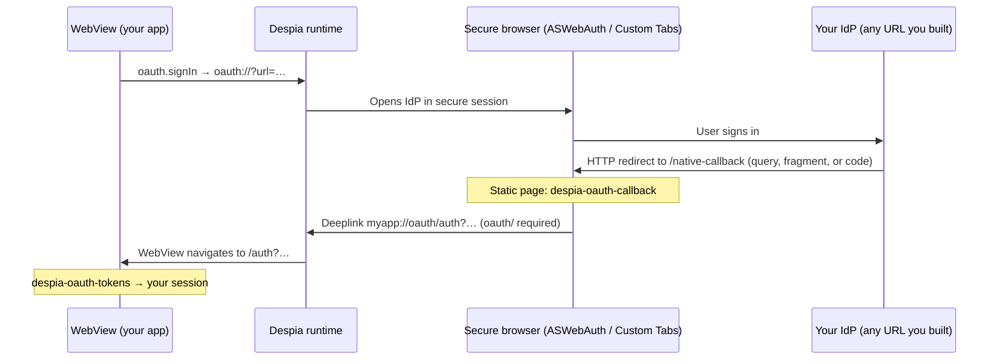
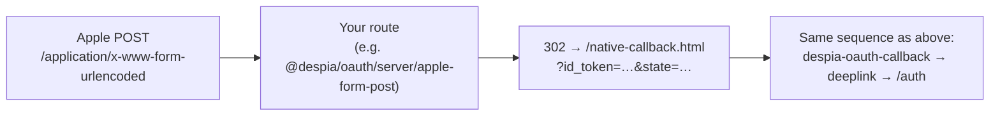

# Despia OAuth

Published on npm as **`@despia/oauth`**. Provider-agnostic OAuth for Despia apps with **zero runtime dependencies**.

Despia OAuth boils down to two URL protocols:

- **Open secure browser session** (native only): `oauth://?url=...`
- **Close it + return to your WebView**: `{scheme}://oauth/...` (**`oauth/` is required**)

This package is a small wrapper around that mechanism:

- `oauth.signIn(...)` opens the secure browser the right way (native) or navigates normally (web)
- `<despia-oauth-callback>` implements `/native-callback` (runs inside the secure browser session)
- `<despia-oauth-tokens>` implements `/auth` (runs inside your WebView)

## Design goals (what this SDK optimizes for)

General OAuth SDKs often bundle provider clients, framework adapters, and heavy assumptions. **`@despia/oauth` is intentionally narrow**: it focuses on the **Despia native secure browser ↔ WebView handoff** (the `oauth://` bridge and the `{scheme}://oauth/...` return path), while you keep **full control** of authorize URLs (Supabase, Auth0, Clerk, your own backend, etc.).

What you get in practice:

- **Zero runtime dependencies** — small surface area, easy to audit and ship.
- **Provider-agnostic** — you pass whatever authorize URL your IdP needs; we don’t lock you to one vendor.
- **Query, fragment, and code** — callback parsing defaults to **query + fragment** (query wins); code flow can POST to your `exchangeEndpoint`.
- **First-class Apple `form_post` story** — optional NPM server helper turns a POST body into a **302** to your static `/native-callback.html?...` so the same web components keep working (see **Apple `form_post` (Android)** later in this README).

That combination is uncommon in “generic web OAuth” libraries because most of them are not built around **in-app secure browser sessions** and a **fixed OS-level deeplink contract** the way Despia is.

## Install

```bash
npm install @despia/oauth
```

## End-to-end flow (native)



**In one line:** sign-in opens the secure browser → IdP lands on **`/native-callback`** → that page emits **`{scheme}://oauth/auth?...`** → Despia returns the WebView to **`/auth`** with the same params.

### Flow variant: Apple `form_post` (Android)

Apple may POST credentials to your redirect URI instead of putting them in the URL. A **static HTML** file cannot read that POST body, so you add a **tiny server route** that reads the body and **redirects** to the same static page with tokens in the **query string** (what `<despia-oauth-callback>` already expects).



After the redirect, the rest of the diagram is **identical** to the native flow: static callback page → `myapp://oauth/auth?...` → `/auth`.

## How it works (in one minute)

1. Your app calls `oauth.signIn({ url, ... })`
2. Despia opens a secure browser session (ASWebAuth / Custom Tabs)
3. Provider redirects to your `/native-callback` page (or, for Apple `form_post`, your **server** first redirects to `/native-callback.html?...`)
4. `/native-callback` fires `myapp://oauth/auth?...` (**`oauth/` is required**)
5. Despia closes the browser and navigates your WebView to `/auth?...`
6. `/auth` reads tokens and sets your session

## Why this works with “anything”

Providers return credentials in different places:

- **Query**: `?access_token=...&refresh_token=...`
- **Fragment**: `#access_token=...&refresh_token=...`
- **Code flow**: `?code=...` (you exchange it server-side)

This package handles all of these by default:

- `<despia-oauth-callback>`, `<despia-oauth-tokens>`, and `parseCallback()` default to checking **both query + fragment** (query wins).
- `&` separators are handled via `URLSearchParams`.
- For code flow, set `tokenLocation: 'code'` and provide an `exchangeEndpoint` (or handle exchange yourself).

If you want to be explicit, set `tokenLocation`:

```ts
oauth.signIn({ url, deeplinkScheme, appOrigin, tokenLocation: 'fragment' }) // hash
oauth.signIn({ url, deeplinkScheme, appOrigin, tokenLocation: 'query' })    // query
oauth.signIn({ url, deeplinkScheme, appOrigin, tokenLocation: 'both' })     // default
oauth.signIn({ url, deeplinkScheme, appOrigin, tokenLocation: 'code', exchangeEndpoint })
```

## Quick start

You need exactly two routes/pages:

- `/native-callback` (secure browser session)
- `/auth` (your WebView)

And one sign-in call.

### 1) Sign-in button (any provider)

Build the authorize URL however you want (Supabase, Auth0, Clerk, custom backend…) and pass it in:

```ts
import { oauth } from '@despia/oauth'

oauth.signIn({
  url: 'https://your-idp.example/authorize?...',
  deeplinkScheme: 'myapp',   // required, user-provided
  appOrigin: 'https://yourapp.com',
  tokenLocation: 'both',     // default: detects query vs fragment
})
```

If your provider returns `?code=...` and you want `/native-callback` to exchange it:

```ts
oauth.signIn({
  url: 'https://your-idp.example/authorize?...',
  deeplinkScheme: 'myapp',
  appOrigin: 'https://yourapp.com',
  tokenLocation: 'code',
  exchangeEndpoint: 'https://api.yourapp.com/auth/exchange',
})
```

### 2) `/native-callback` page (secure browser session)

Create `public/native-callback.html`:

```html
<!doctype html>
<meta charset="utf-8" />
<meta name="viewport" content="width=device-width,initial-scale=1" />
<title>Completing sign in…</title>

<despia-oauth-callback></despia-oauth-callback>
<script type="module" src="https://unpkg.com/@despia/oauth/dist/umd/web-components.min.js"></script>
```

What it does:

- Parses tokens from query and/or fragment (based on `tokenLocation`)
- If `tokenLocation: 'code'`, POSTs `{ code, redirect_uri, state }` to your `exchangeEndpoint`
- Fires the deeplink `{scheme}://oauth/auth?...` to close the secure browser and return to your app

### 3) `/auth` page (WebView)

Add the element and listen for tokens:

```html
<despia-oauth-tokens></despia-oauth-tokens>
<script type="module">
  import 'https://unpkg.com/@despia/oauth/dist/umd/web-components.min.js'

  document
    .querySelector('despia-oauth-tokens')
    .addEventListener('tokens', async (e) => {
      const tokens = e.detail
      // call your auth SDK here (Supabase/Firebase/custom)
    })
</script>
```

Concrete example (custom backend + redirect + error handling):

```html
<despia-oauth-tokens redirect-on-success="/"></despia-oauth-tokens>

<script type="module">
  import 'https://unpkg.com/@despia/oauth/dist/umd/web-components.min.js'

  const el = document.querySelector('despia-oauth-tokens')

  el.addEventListener('oauth-error', (e) => {
    console.error('OAuth error:', e.detail) // { code, description }
  })

  el.addEventListener('tokens', async (e) => {
    const t = e.detail // { access_token?, refresh_token?, id_token?, code?, session_token?, ... }

    // Send whatever you received to your backend to establish a session.
    await fetch('/api/session', {
      method: 'POST',
      headers: { 'Content-Type': 'application/json' },
      body: JSON.stringify(t),
      credentials: 'include',
    })

    // If you didn't set redirect-on-success, redirect manually:
    // window.location.href = '/'
  })
</script>
```

## Notes / gotchas (short)

- **Deeplink must include `oauth/`**: `myapp://oauth/auth` works; `myapp://auth` does not.
- **Deeplink scheme is required**: we never default it; pass your scheme from Despia.

## Apple `form_post` (Android): tiny server bridge

Apple can return credentials via **`response_mode=form_post`**, which means the browser loads your redirect URL with an **`application/x-www-form-urlencoded` POST body**.

A **static** `/native-callback.html` cannot read that POST body, so you need a **small server route** that:

1. Accepts the POST from Apple
2. Redirects (`302`) to your static `/native-callback.html?...` with the same fields in the **query string** (or a `session_token` you mint server-side)

This package includes an optional, dependency-free helper:

```ts
import { handleAppleFormPostRequest } from '@despia/oauth/server/apple-form-post'

export default async function handler(req: Request): Promise<Response> {
  // Works anywhere you have Web `Request`/`Response`:
  // Deno, Bun, Cloudflare Workers, Supabase Edge Functions, Convex HTTP actions (fetch API), modern Node (undici).
  return handleAppleFormPostRequest(req, {
    appOrigin: 'https://yourapp.com',
    nativeCallbackPath: '/native-callback.html',

    // Recommended: exchange/validate server-side, then forward an opaque token instead of raw `id_token` in the URL.
    // mintSessionToken: async (fields) => { /* ... */ return 'opaque' },
  })
}
```

Point Apple’s redirect URI for Android at this route (not directly at the static HTML file).

## API (small)

- `oauth.signIn({ url, deeplinkScheme, appOrigin, tokenLocation?, exchangeEndpoint?, authPath? })`
- `oauth.apple({ ... })` (iOS uses Apple JS popup, Android uses redirect)
- `oauth.tiktok({ ... })` (code flow + exchange)
- Escape hatches: `openOAuth`, `detectRuntime`, `encodeState/decodeState`, `parseCallback`,
  `watchCallbackUrl`, `handleNativeCallback`, `buildDeeplink`

## License

MIT. See [`LICENSE`](./LICENSE).
