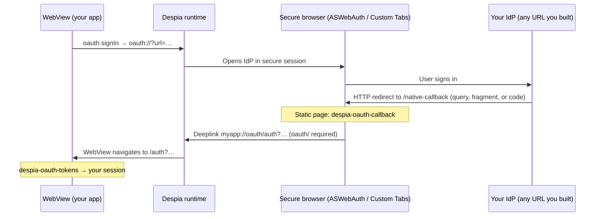
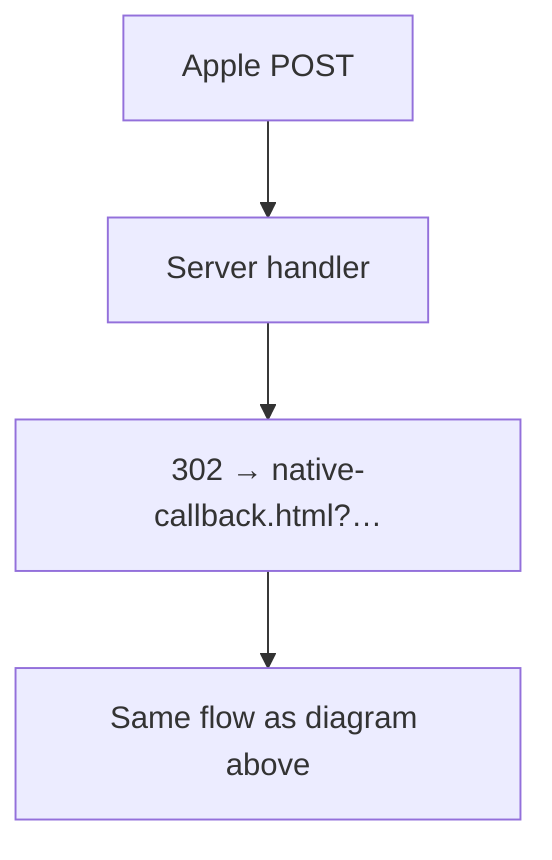

# Despia OAuth

NPM: `@despia/oauth`. No runtime dependencies.

On Despia, sign-in is basically two mechanics:

- Native opens the IdP in a secure browser: `oauth://?url=...`
- When you’re done, hit your app again with `oauth/` in the path: `{scheme}://oauth/...` (required)

This repo wires that up: `oauth.signIn` for the open, `<despia-oauth-callback>` on whatever you serve as `/native-callback`, `<despia-oauth-tokens>` on `/auth`. You still build the authorize URL yourself (Supabase, Clerk, hand-rolled, whatever).

## Install

```bash
npm install @despia/oauth
```

## Flow



Apple on Android sometimes uses `form_post`: Apple POSTs a form body to your server instead of putting tokens in the URL. Static HTML can’t read that body, so add a route that turns the POST into a normal GET on `/native-callback.html?...`. Helper: `@despia/oauth/server/apple-form-post` (section at the bottom of this file).



## Callback shape (query, hash, code)

IdPs disagree on where tokens live (`?…`, `#…`, or `?code=`). By default the web components and `parseCallback()` look at **query and fragment** (query wins). Code flow: set `tokenLocation: 'code'` and either pass `exchangeEndpoint` or exchange yourself.

```ts
oauth.signIn({ url, deeplinkScheme, appOrigin, tokenLocation: 'fragment' })
oauth.signIn({ url, deeplinkScheme, appOrigin, tokenLocation: 'query' })
oauth.signIn({ url, deeplinkScheme, appOrigin, tokenLocation: 'both' }) // default
oauth.signIn({ url, deeplinkScheme, appOrigin, tokenLocation: 'code', exchangeEndpoint })
```

## Quick start

Two pages: `/native-callback` (runs inside the secure browser) and `/auth` (your WebView). One `oauth.signIn` from the app.

**Sign-in**

```ts
import { oauth } from '@despia/oauth'

oauth.signIn({
  url: 'https://your-idp.example/authorize?...',
  deeplinkScheme: 'myapp',
  appOrigin: 'https://yourapp.com',
  tokenLocation: 'both',
})
```

**`/native-callback`** — e.g. `public/native-callback.html`:

```html
<!doctype html>
<meta charset="utf-8" />
<meta name="viewport" content="width=device-width,initial-scale=1" />
<title>Completing sign in…</title>

<despia-oauth-callback></despia-oauth-callback>
<script type="module" src="https://unpkg.com/@despia/oauth/dist/umd/web-components.min.js"></script>
```

With `tokenLocation: 'code'`, the callback element POSTs `{ code, redirect_uri, state }` to `exchangeEndpoint`, then fires `{scheme}://oauth/auth?...`.

**`/auth`**

```html
<despia-oauth-tokens></despia-oauth-tokens>
<script type="module">
  import 'https://unpkg.com/@despia/oauth/dist/umd/web-components.min.js'

  document.querySelector('despia-oauth-tokens').addEventListener('tokens', async (e) => {
    const tokens = e.detail
    // hand off to your backend / SDK
  })
</script>
```

Example with errors + POST session + optional redirect:

```html
<despia-oauth-tokens redirect-on-success="/"></despia-oauth-tokens>

<script type="module">
  import 'https://unpkg.com/@despia/oauth/dist/umd/web-components.min.js'

  const el = document.querySelector('despia-oauth-tokens')

  el.addEventListener('oauth-error', (e) => {
    console.error(e.detail)
  })

  el.addEventListener('tokens', async (e) => {
    await fetch('/api/session', {
      method: 'POST',
      headers: { 'Content-Type': 'application/json' },
      body: JSON.stringify(e.detail),
      credentials: 'include',
    })
  })
</script>
```

## Gotchas

- Deeplink path must include `oauth/`: `myapp://oauth/auth` yes, `myapp://auth` no.
- `deeplinkScheme` is required; nothing invents it for you.

## Apple `form_post` (Android)

Apple may use `response_mode=form_post`: the redirect is a POST with `application/x-www-form-urlencoded` body. Serve a small endpoint that reads the body and returns **302** to your static `/native-callback.html?...` (same query params the callback element already understands), or mint a `session_token` server-side and redirect with that instead of raw `id_token` in the URL.

```ts
import { handleAppleFormPostRequest } from '@despia/oauth/server/apple-form-post'

export default async function handler(req: Request): Promise<Response> {
  return handleAppleFormPostRequest(req, {
    appOrigin: 'https://yourapp.com',
    nativeCallbackPath: '/native-callback.html',
    // mintSessionToken: async (fields) => 'opaque',
  })
}
```

Use this URL as Apple’s redirect URI for that flow—not the `.html` file directly.

## API

- `oauth.signIn({ url, deeplinkScheme, appOrigin, tokenLocation?, exchangeEndpoint?, authPath? })`
- `oauth.apple({ ... })` — iOS popup path, Android redirect
- `oauth.tiktok({ ... })` — code + exchange
- Lower level: `openOAuth`, `detectRuntime`, `encodeState` / `decodeState`, `parseCallback`, `watchCallbackUrl`, `handleNativeCallback`, `buildDeeplink`

## License

MIT — [`LICENSE`](./LICENSE).
